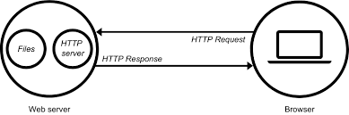

# **async-http**

Overview
---
A python HTTP web server

Contribution
---
For bug reports or requests please submit an [issue](https://github.com/tranlyvu/async-http.git/issues).

For new feature contribution, please follow the following instruction:

1. Fork the repo https://github.com/tranlyvu/async-http.git to your own github

2. Clone from your own repo

`$ git clone https://github.com/<your name>/async-http.git`

3. Make sure you are at dev branch 

`$ git checkout dev && git pull`

4. Create your feature/bug-fix branch

`$ git checkout -b <feature/bug>/<branch-name>`

5. Commit your changes 

`$ git commit -am 'Add some new feature'`

6. Push to the branch 

`$ git push`

7. Go to your own repo and create a new Pull Request against 'dev' branch

Contact
---
Feel free to contact me to discuss any issues, questions, or comments.
*  Email: vutransingapore@gmail.com
*  Linkedln: [@vutransingapore](https://www.linkedin.com/in/tranlyvu/)
*  GitHub: [Tran Ly Vu](https://github.com/tranlyvu)
*  Blog: [tranlyvu.github.io](https://tranlyvu.github.io/)

License
---
See the [LICENSE](https://github.com/tranlyvu/async-http/blob/master/LICENSE) file for license rights and limitations (Apache License 2.0).
